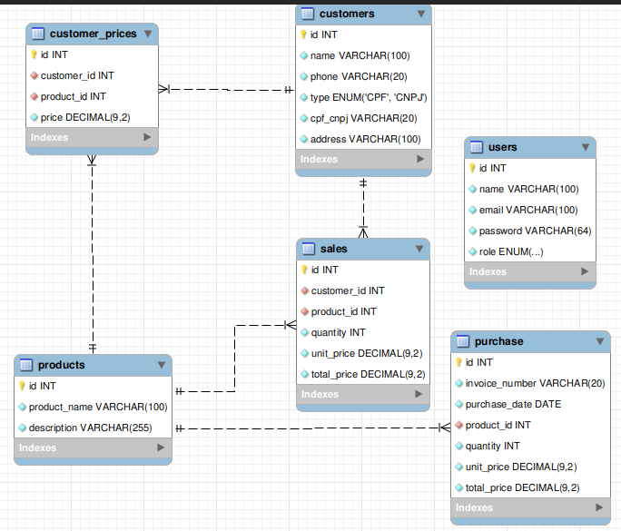

## API DISK AGUA EM DESENVOLVIMENTO...

Este projeto envolve a criação de uma aplicação web para gerenciar vendas de um serviço de entrega de água. Com o objetivo de facilitar a organização e eficiência do seu negócio, a aplicação abrange diversas funcionalidades essenciais, tais como a inclusão de novos clientes, emissão de notas de venda e o controle de estoque.

### Tecnologias utilizada:

### Tecnologias Utilizadas:

- Linguagem Principal: JavaScript
- Servidor: Node.js
- Framework Web: ExpressJS
- Segurança do Código: TypeScript
- Mapeamento Objeto-Relacional: Sequelize
- Banco de Dados: PostgreSQL

### Estrutura do Banco de Dados:

### Funcionalidades Destacadas:

Este projeto visa oferecer uma solução completa e eficiente para o seu serviço de entrega de água. Fique atento às atualizações e ao progresso do desenvolvimento desta aplicação empolgante!
